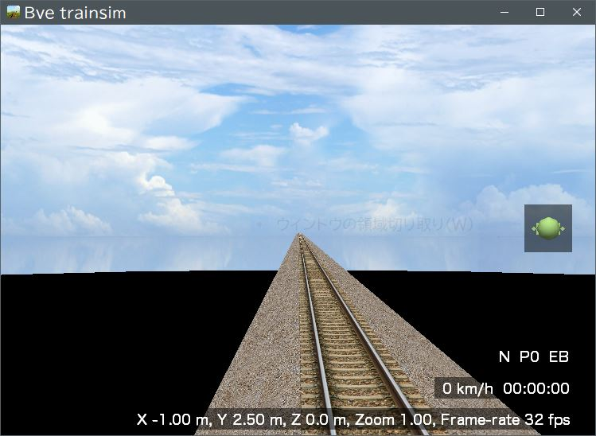

## acrobat
小田急線 通勤準急 向ヶ丘遊園～代々木上原

### フォルダ構成
- Scenarios
  - p4ken
    - acrobat
      - 直下に `acrobat.txt`
    - [empty][] 
      - 直下に `vehicle.ini`
    - [GeneralStr_v099r2_dds][]
      - 直下に多数のフォルダ

[empty]: https://github.com/p4ken/bve-empty
[GeneralStr_v099r2_dds]: http://kty-bvememo.hatenablog.jp/entry/GeneralStr

本リポジトリは "acrobat" です。  
それ以外はそれぞれ導入が必要です。

### 運転する方へ
acrobat.txt をBveのウィンドウへD&Dすると起動します。

### 開発する方へ
当リポジトリへのプルリクを歓迎しております。

### ライセンス
[MIT License](LICENSE)
